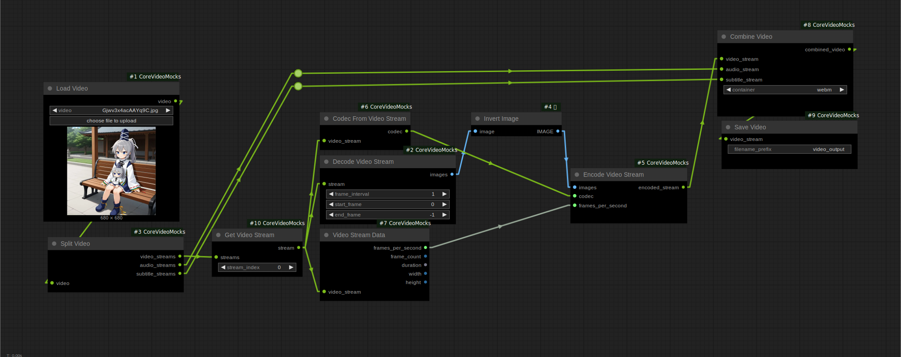

# RFC: Core Video Nodes

- Start Date: 2025/03/15
- Target Major Version: TBD
- Reference Issues: N/A
- Implementation PR: 

## Summary

This RFC proposes the integration of fundamental video input and output functionalities into ComfyUI. Specifically, features for loading, splitting (demuxing), decoding, encoding, combining (muxing), and saving video files directly within the ComfyUI core. This enhancement aims to streamline video-related workflows, broaden ComfyUI's applicability, and reduce reliance on external custom nodes for basic video operations.

## Basic example

A basic example of the proposed Node usage:

## Motivation

Video generation has become ubiquitous, and new video models that can run on consumer-grade hardware are becoming common. This means that having better control over video and its various components directly in the Comfy Core would provide a solid base for usage and experimentation for users and developers.

The most popular third-party Node (VHS) abstracts away several aspects of what a video file contains. If further development on video is to be explored, ComfyUI needs to be able to handle these more fundamental aspects, at least in a general sense.

This RFC focuses on the following:
- **Loading**: It is currently not possible to load a video using only ComfyUI Core; third-party nodes are required. 
- **Demultiplexing (Demuxing/Splitting Video)**: Videos are more than just a series of images. They can contain audio, subtitles, and even multiple tracks of the same type (even video). ComfyUI should be able to handle these situations, including corner cases.
- **Decoding**: Once the video streams are demuxed, they need to be decoded. This process converts the compressed video data into a sequence of uncompressed frames. Due to possible licensing issues, ComfyUI Core should prioritize support for open codecs like VP9 and AV1.
- **Encoding**: After processing the video frames, they need to be encoded back into a compressed video stream. The main reason to manipulate streams is to combine them arbitrarily. 
- **Multiplexing (Muxing/Combining Video)**: Once the individual video, audio, and subtitle streams have been processed and encoded, ComfyUI needs to provide a method for combining them into a final video container. To start with, ComfyUI should support:
    - **WebM Container Format**: Prioritizing the WebM container format, which is well-suited for AV1 and VP9 and offers excellent compatibility with web browsers and open-source tools.
    - **Arbitrary Stream Combinations**: Allowing users to combine any number of AV1 or VP9 video streams, along with audio and subtitle streams, including those with different resolutions, frame rates, and durations.
- **Saving**: The video file can be saved without requiring many additional options on the node, as those would have been handled by the encoding and multiplexing steps.

## Detailed design

This is the bulk of the RFC. Explain the design in enough detail for somebody
familiar with Vue to understand, and for somebody familiar with the
implementation to implement. This should get into specifics and corner cases,
and include examples of how the feature is used. Any new terminology should be
defined here.

I have provided a [set of mock custom nodes](https://github.com/Immac/ComfyUI-CoreVideoMocks) that represent what I believe is a good starting point for this development. Please note that these are just mocks and thus connect to anything, so use the provided [workflow](https://github.com/Immac/ComfyUI-CoreVideoMocks/blob/master/Mock%20Video%20Workflows.json) to understand 
how they are supposed to be used.

The node `SaveWEBM` already does a good amount of what is needed; it just needs to be redistributed to be handled by several nodes. The main idea is to use pyAv and/or pyffmpeg to implement each node as needed. At the time of writing, I have had some issues with pyAv while trying their examples, as seen [here](https://github.com/PyAV-Org/PyAV/discussions/1769). So the version used should be thoroughly tested.
My current investigation into this topic is very limited and summarized [here](https://github.com/Immac/video_manipulation_with_python). Nevertheless, the `SaveWEBM` node serves as an excellent starting point for further development.

Regarding the actual coding of the nodes, having a _generic mechanism_ for nodes to receive complete functions from their inputs would be a way to separately implement codecs, similar to how it's done with KSamplers. However, I believe it can be done even more _generic_. I have not studied the code extensively enough for a formal proposal.

## Drawbacks

- There is already a way to load and save videos, so if there are more pressing matters, this is not completely necessary.
- Video encoding tends to be fickle, so creating tests for the various moving parts will be challenging.
- People might misunderstand the nature of `Streams`, so some education on how video files actually work could be needed.

## Alternatives

An alternative approach is to adopt the video node implementations provided by VHS.

While basic video processing is currently supported, as video generation needs increase, more granular control over video and its components will become essential for efficiency and advanced workflows. Not implementing this would require ComfyUI to rely on more custom nodes to fill the gap.

## Adoption strategy

It only adds new nodes, so there should be no conflicts with existing workflows. Adding the nodes as BETA and giving them some time to be tested would be fine.

- Create the necessary nodes to go from video to video, excluding audio and subtitles, and add an experimental flag to set them as `BETA`.
- Create examples and documentation on intended usage.
- Gradually add the missing streams.

## Miscellaneous

Decoding can produce three types of frames: I-frames (Intra-coded), P-frames (Predicted), and B-frames (Bi-predictive). For image generation, when extracting frames as individual images, each will be a full, independent image, regardless of its original frame type. However, being able to distinguish between these frame types might be useful for future features or optimizations.

Some practical uses for videos with multiple video streams:
- Adaptive bitrate streaming (where different quality versions of the video are stored in the same file).
- Videos with multiple camera angles.
- Videos with different language versions.

## Unresolved questions

The actual code inside the nodes is to be determined still; video encoding can be messy.

How will the separate new Video Container and Video/Audio/Subtitles Streams handle metadata? Once separated from its parent Container, it could be advantageous for a Stream to keep most of the relevant information. I do not know if it's done that way already.

There also needs to be a mechanism for managing the resource consumption of the previews when loading videos.

I have probably overlooked a lot of things, but I hope this is comprehensive enough to be a start.
